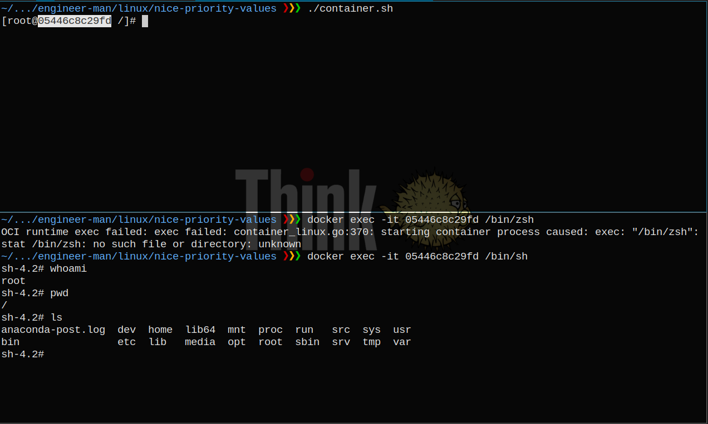

## Installation
- `pacman -S docker`
- `systemctl start docker.service` and `systemctl enable docker.service`
- (Optional) `usermod -aG docker phunc20`, re-login and `systemctl restart docker.service`

## Similarity Showcase
<pre>
# docker
docker container ls -a
docker container attach \<ID\>
# tmux
tmux ls
tmux attach -t \<ID\>
</pre>

## Get control
If you have a container running, and, say, you want to get a shell from within the container (getting some
sort of a control), you can for example use the command **`docker exec -it <container-id> /bin/bash`**

