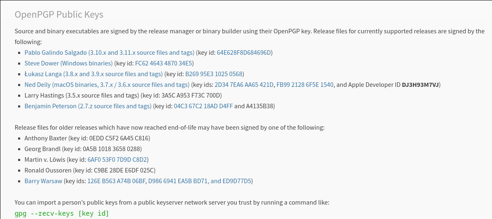
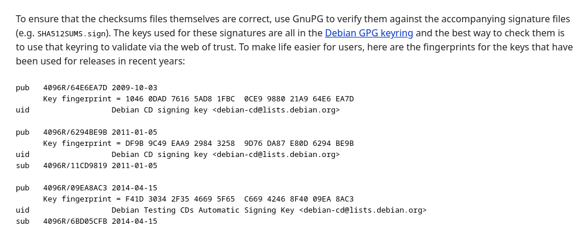

## `--recv-keys <key_id>`
Sometimes, I don't know why, the key ID should not be separated by white spaces.
```
[phunc20@artichaut-x220 downloads]$ gpg --recv-key "D986 6941 EA5B BD71"
gpg: "D986 6941 EA5B BD71" not a key ID: skipping
[phunc20@artichaut-x220 downloads]$ gpg --recv-keys "D9866941EA5BBD71"
gpg: key D9866941EA5BBD71: public key "Barry A. Warsaw <barry@warsaw.us>" imported
gpg: Total number processed: 1
gpg:               imported: 1
```

## How to Verify A Signature?
- First we have to import the associated public key 
  - **`gpg --receive-keys <key_id | fingerprint>`** or `gpg --import <some_pubkey_file>`, where `<some_pubkey_file>` is a file you obtained from the person/organization whose file you want to download and whose signiture to verify
  - `key_id` is usually a string of `4*4=16` hexadecimal digits like 
  - `fingerprint` is sth similar, consisting of `4*10=40` hexadecimal digits 
- [https://www.devdungeon.com/content/how-verify-gpg-signature](https://www.devdungeon.com/content/how-verify-gpg-signature)


```
[phunc20@artichaut-x220 downloads]$ ls *julia*
julia-1.5.0-linux-x86_64.tar.gz      julia-1.5.0.tar.gz      juliareleases.asc
julia-1.5.0-linux-x86_64.tar.gz.asc  julia-1.5.0.tar.gz.asc
[phunc20@artichaut-x220 downloads]$
[phunc20@artichaut-x220 downloads]$ gpg --import juliareleases.asc
gpg: key 66E3C7DC03D6E495: public key "Julia (Binary signing key) <buildbot@julialang.org>" imported
gpg: Total number processed: 1
gpg:               imported: 1
[phunc20@artichaut-x220 downloads]$ gpg --verify julia-1.5.0-linux-x86_64.tar.gz.asc
gpg: assuming signed data in 'julia-1.5.0-linux-x86_64.tar.gz'
gpg: Signature made Sun 02 Aug 2020 09:23:20 AM +07
gpg:                using RSA key 3673DF529D9049477F76B37566E3C7DC03D6E495
gpg:                issuer "buildbot@julialang.org"
gpg: Good signature from "Julia (Binary signing key) <buildbot@julialang.org>" [unknown]
gpg: WARNING: This key is not certified with a trusted signature!
gpg:          There is no indication that the signature belongs to the owner.
Primary key fingerprint: 3673 DF52 9D90 4947 7F76  B375 66E3 C7DC 03D6 E495
[phunc20@artichaut-x220 downloads]$ gpg --verify julia-1.5.0.tar.gz.asc
gpg: assuming signed data in 'julia-1.5.0.tar.gz'
gpg: Signature made Sun 02 Aug 2020 07:59:33 AM +07
gpg:                using RSA key 3673DF529D9049477F76B37566E3C7DC03D6E495
gpg:                issuer "buildbot@julialang.org"
gpg: Good signature from "Julia (Binary signing key) <buildbot@julialang.org>" [unknown]
gpg: WARNING: This key is not certified with a trusted signature!
gpg:          There is no indication that the signature belongs to the owner.
Primary key fingerprint: 3673 DF52 9D90 4947 7F76  B375 66E3 C7DC 03D6 E495
[phunc20@artichaut-x220 downloads]$
```

## Example: Debian iso
```bash
[phunc20@homography-x220t debian-iso]$ ll
total 3.7G
-rw-r--r-- 1 transmission transmission 3.7G Dec 15 15:37 debian-10.7.0-amd64-DVD-1.iso
-rw-r--r-- 1 phunc20      phunc20      3.0K Dec 17 10:54 SHA512SUMS.txt
-rw-r--r-- 1 phunc20      phunc20       833 Dec 17 10:54 SHA512SUMS.sign.txt
[phunc20@homography-x220t debian-iso]$ gpg --recv-key "F41D 3034 2F35 4669 5F65  C669 4246 8F40 09EA 8AC3"
gpg: key 42468F4009EA8AC3: public key "Debian Testing CDs Automatic Signing Key <debian-cd@lists.debian.org>" imported
gpg: Total number processed: 1
gpg:               imported: 1
[phunc20@homography-x220t debian-iso]$ gpg --verify SHA512SUMS.sign.txt SHA512SUMS.txt
gpg: Signature made Sun 06 Dec 2020 08:46:12 AM +07
gpg:                using RSA key DF9B9C49EAA9298432589D76DA87E80D6294BE9B
gpg: Can't check signature: No public key
[phunc20@homography-x220t debian-iso]$
```

#### Note
- Error message if you do only **`gpg --verify SHA512SUMS.sign.txt`**
  ```bash
  [phunc20@homography-x220t debian-iso]$ gpg --verify SHA512SUMS.sign.txt
  gpg: no signed data
  gpg: can't hash datafile: No data
  ```
- This is because, it concerns a **detached signature** and expects you to provide another file with data in it; otherwise, it will assume the data file named **one extension less**, e.g. if the signature is `foo.bar` then `gpg` will expect the data file named `foo`.
- Consequently, had you named the files `SHA512SUMS` and `SHA512SUMS.sign` instead, you'll have no trouble:
  ```bash
  [phunc20@homography-x220t debian-iso]$ ll
  total 3.7G
  -rw-r--r-- 1 transmission transmission 3.7G Dec 15 15:37 debian-10.7.0-amd64-DVD-1.iso
  -rw-r--r-- 1 phunc20      phunc20      3.0K Dec 17 10:54 SHA512SUMS
  -rw-r--r-- 1 phunc20      phunc20       833 Dec 17 10:54 SHA512SUMS.sign
  [phunc20@homography-x220t debian-iso]$ gpg --verify SHA512SUMS.sign
  gpg: assuming signed data in 'SHA512SUMS'
  gpg: Signature made Sun 06 Dec 2020 08:46:12 AM +07
  gpg:                using RSA key DF9B9C49EAA9298432589D76DA87E80D6294BE9B
  gpg: Can't check signature: No public key
  ```
- The verification message above seems to indicate that the verification had failed. Note that
  - The fingerprints I typed have been provided [https://www.debian.org/CD/verify](https://www.debian.org/CD/verify)
  - And the above link is clearly mentioned in the [installation guide](https://cdimage.debian.org/debian-cd/current/amd64/bt-dvd/)
  - There are several signatures provided, so if one is not enough, just add the others: (It seems that `--keyserver` is optional. `--recv-keys` suffices. Besides, `--receive-keys <fingerprint>` and `--receive-key <fingerprint>`, i.e. with or w/o `s`, seems to be the same.)
    ```bash
    [phunc20@homography-x220t debian-iso]$ gpg --keyserver keyring.debian.org --recv-keys "F41D 3034 2F35 4669 5F65  C669 4246 8F40 09EA 8AC3"
    gpg: key 42468F4009EA8AC3: "Debian Testing CDs Automatic Signing Key <debian-cd@lists.debian.org>" not changed
    gpg: Total number processed: 1
    gpg:              unchanged: 1
    [phunc20@homography-x220t debian-iso]$ gpg --verify SHA512SUMS.sign
    gpg: assuming signed data in 'SHA512SUMS'
    gpg: Signature made Sun 06 Dec 2020 08:46:12 AM +07
    gpg:                using RSA key DF9B9C49EAA9298432589D76DA87E80D6294BE9B
    gpg: Can't check signature: No public key
    [phunc20@homography-x220t debian-iso]$ gpg --keyserver keyring.debian.org --recv-keys "DF9B 9C49 EAA9 2984 3258  9D76 DA87 E80D 6294 BE9B"
    gpg: key DA87E80D6294BE9B: public key "Debian CD signing key <debian-cd@lists.debian.org>" imported
    gpg: Total number processed: 1
    gpg:               imported: 1
    [phunc20@homography-x220t debian-iso]$ gpg --verify SHA512SUMS.sign
    gpg: assuming signed data in 'SHA512SUMS'
    gpg: Signature made Sun 06 Dec 2020 08:46:12 AM +07
    gpg:                using RSA key DF9B9C49EAA9298432589D76DA87E80D6294BE9B
    gpg: Good signature from "Debian CD signing key <debian-cd@lists.debian.org>" [unknown]
    gpg: WARNING: This key is not certified with a trusted signature!
    gpg:          There is no indication that the signature belongs to the owner.
    Primary key fingerprint: DF9B 9C49 EAA9 2984 3258  9D76 DA87 E80D 6294 BE9B
    [phunc20@homography-x220t debian-iso]$
    ```


## A shortcut learned from Fedora
`curl`ing the public key to stdout; piping it to `gpg --import`.
```bash
# Example 1
~/Downloads ❯❯❯ curl https://getfedora.org/static/fedora.gpg
-----BEGIN PGP PUBLIC KEY BLOCK-----

mQINBF4wBvsBEADQmcGbVUbDRUoXADReRmOOEMeydHghtKC9uRs9YNpGYZIB+bie
bGYZmflQayfh/wEpO2W/IZfGpHPL42V7SbyvqMjwNls/fnXsCtf4LRofNK8Qd9fN
kYargc9R7BEz/mwXKMiRQVx+DzkmqGWy2gq4iD0/mCyf5FdJCE40fOWoIGJXaOI1
Tz1vWqKwLS5T0dfmi9U4Tp/XsKOZGvN8oi5h0KmqFk7LEZr1MXarhi2Va86sgxsF
QcZEKfu5tgD0r00vXzikoSjn3qA5JW5FW07F1pGP4bF5f9J3CZbQyOjTSWMmmfTm
2d2BURWzaDiJN9twY2yjzkoOMuPdXXvovg7KxLcQerKT+FbKbq8DySJX2rnOA77k
UG4c9BGf/L1uBkAT8dpHLk6Uf5BfmypxUkydSWT1xfTDnw1MqxO0MsLlAHOR3J7c
oW9kLcOLuCQn1hBEwfZv7VSWBkGXSmKfp0LLIxAFgRtv+Dh+rcMMRdJgKr1V3FU+
rZ1+ZAfYiBpQJFPjv70vx+rGEgS801D3PJxBZUEy4Ic4ZYaKNhK9x9PRQuWcIBuW
6eTe/6lKWZeyxCumLLdiS75mF2oTcBaWeoc3QxrPRV15eDKeYJMbhnUai/7lSrhs
EWCkKR1RivgF4slYmtNE5ZPGZ/d61zjwn2xi4xNJVs8q9WRPMpHp0vCyMwARAQAB
tDFGZWRvcmEgKDMzKSA8ZmVkb3JhLTMzLXByaW1hcnlAZmVkb3JhcHJvamVjdC5v
cmc+iQI4BBMBAgAiBQJeMAb7AhsPBgsJCAcDAgYVCAIJCgsEFgIDAQIeAQIXgAAK
CRBJ/XdJlXD/MZm2D/9kriL43vd3+0DNMeA82n2v9mSR2PQqKny39xNlYPyy/1yZ
P/KXoa4NYSCA971LSd7lv4n/h5bEKgGHxZfttfOzOnWMVSSTfjRyM/df/NNzTUEV
7ORA5GW18g8PEtS7uRxVBf3cLvWu5q+8jmqES5HqTAdGVcuIFQeBXFN8Gy1Jinuz
AH8rJSdkUeZ0cehWbERq80BWM9dhad5dW+/+Gv0foFBvP15viwhWqajr8V0B8es+
2/tHI0k86FAujV5i0rrXl5UOoLilO57QQNDZH/qW9GsHwVI+2yecLstpUNLq+EZC
GqTZCYoxYRpl0gAMbDLztSL/8Bc0tJrCRG3tavJotFYlgUK60XnXlQzRkh9rgsfT
EXbQifWdQMMogzjCJr0hzJ+V1d0iozdUxB2ZEgTjukOvatkB77DY1FPZRkSFIQs+
fdcjazDIBLIxwJu5QwvTNW8lOLnJ46g4sf1WJoUdNTbR0BaC7HHj1inVWi0p7IuN
66EPGzJOSjLK+vW+J0ncPDEgLCV74RF/0nR5fVTdrmiopPrzFuguHf9S9gYI3Zun
Yl8FJUu4kRO6JPPTicUXWX+8XZmE94aK14RCJL23nOSi8T1eW8JLW43dCBRO8QUE
Aso1t2pypm/1zZexJdOV8yGME3g5l2W6PLgpz58DBECgqc/kda+VWgEAp7rO2JkC
DQRdUVarARAA1jAamL/xta+D8Moj0An4OX1xRl1dRQmd9qjIvYC1E79Ql+62Mh+C
J4/d6InPpbdZENJEApCDTsEHMzpJulw5BHpJjKx5JyaRS8K0yuAEtvG2BdkYyzPk
Cf3RlwzD2LD9LZC76MWh6/Vk0avPQPgJjjXFAECDCYNycVwAGnwYtlLM1FBDyFN+
TMrnxbdnj3dZP+oVQDvEtlU+9k8V0mOx2uF9idKRs26kOg6twFc6ILJ6CItPQO32
LrWGT1VQBBkVKmr5dLYfC8rmUoQEmd/AnQBwTL1leG1WYIXf8A1eXr9y11BNKIrS
wKjUnogyd4Kyljer9KnVNJd2GutLLoAAXd8WhPkTnvJAwst1pgGjudUPPNGQNolz
kyRTm6pAUz/Y/fmXkPijRPEgaIh9RMmyrQVPB5soGb7vGQtUylMi+YMBlCbfL3q4
MuQcN0O2r+dtLDRg93CFq+HwQFWMHQaGU/EXLJ1NTz+uzZjhhXMEhSfy6YjjAqWd
SAb4zguysihGWNv+t5I1u95gezhzndfAR7RlZAN0AHVZXErpXv8+vFTgMum4oROp
ncT9vA+CDbLbPMOsq+Bvt2hCDfLtKkUKuukYuZjl08pXvjjbnbXxoN1PZYInIM+q
FZNe0U9I1fbi+iuNbBmdbB/+sk10CmoHQGK98NYsdi+OiYMwvv/ukksAEQEAAbQx
RmVkb3JhICgzMikgPGZlZG9yYS0zMi1wcmltYXJ5QGZlZG9yYXByb2plY3Qub3Jn
PokCOAQTAQIAIgUCXVFWqwIbDwYLCQgHAwIGFQgCCQoLBBYCAwECHgECF4AACgkQ
bBMCbRLJRNC3QA/8CnQDLX86+ztstOv7Dj5629w9/WNg12wfMtIhJkXQS9vQauW7
ccJgJGuyWUSVRcT7DlameigEY0tP6AgZiXNIwkQDRQrTOFI1R00rMayX7j5Hpb65
TRPbXEejgkabo/z2YFGt/YonxfxU1Hw4IeEPdcYkKC6nwcTic62r0B6CvVc6zDUz
ruiepeM3hs2P6HI+g6U/uX3VDv9x4BhTYjWDwuhlc3ogNwAFUdLAshhDbqqnYMFM
VdwSIbdOTOVnHb8YNVPceSN8o5C0MPonb1+KXr04goff9LvuIPNHE/9tQsbHce/g
1R2nsF2xfO0ECHDgIp4NEuUBOu69rj1cZlsv+ekylKg6Mj/EjbFetpU9o7rbIy3r
zcVJMtNdYOcN23OtVHmniq67qxXUbPkcAVZF5rapv4uoNGU1mclhjuoCXfh1gKmN
TWIquPnDLzS2rZgNrDqArETZhPauozPxElYGh/IUqfBnC7s7ff6+D2WRpeQr1HpX
Tog9ttbvK87h5i7OHbIMCSfaYC09HFALDqWzDyNCaRiD0Nkhusiuy5juhxTsWwJM
+yBlLdIMtTMz08gb5wfloA9SPiEF17CW4T+fnfnd5jp6rHeqAzP4Kygc64aFHqDW
nXPbs46ipTq5q3SEdwc9/EkolpXXuX7usT6iXZhmUTY17XMiZW0j1QyJaMeZAg0E
-----END PGP PUBLIC KEY BLOCK-----
~/Downloads ❯❯❯ curl https://getfedora.org/static/fedora.gpg | gpg --import
  % Total    % Received % Xferd  Average Speed   Time    Time     Time  Current
                                 Dload  Upload   Total   Spent    Left  Speed
100 10955  100 10955    0     0  64822      0 --:--:-- --:--:-- --:--:-- 68043
gpg: key 49FD77499570FF31: public key "Fedora (33) <fedora-33-primary@fedoraproject.org>" imported
gpg: key 6C13026D12C944D0: public key "Fedora (32) <fedora-32-primary@fedoraproject.org>" imported
gpg: key 50CB390B3C3359C4: public key "Fedora (31) <fedora-31-primary@fedoraproject.org>" imported
gpg: key 7BB90722DBBDCF7C: public key "Fedora (iot 2019) <fedora-iot-2019@fedoraproject.org>" imported
gpg: key 21EA45AB2F86D6A1: public key "Fedora EPEL (8) <epel@fedoraproject.org>" imported
gpg: key 6A2FAEA2352C64E5: public key "Fedora EPEL (7) <epel@fedoraproject.org>" imported
gpg: key 3B49DF2A0608B895: public key "EPEL (6) <epel@fedoraproject.org>" imported
gpg: Total number processed: 7
gpg:               imported: 7
~/Downloads ❯❯❯ gpg --verify-files Fedora-Workstation-33-1.2-x86_64-CHECKSUM
gpg: Signature made Fri 23 Oct 2020 10:09:17 PM +07
gpg:                using RSA key 963A2BEB02009608FE67EA4249FD77499570FF31
gpg: Good signature from "Fedora (33) <fedora-33-primary@fedoraproject.org>" [unknown]
gpg: WARNING: This key is not certified with a trusted signature!
gpg:          There is no indication that the signature belongs to the owner.
Primary key fingerprint: 963A 2BEB 0200 9608 FE67  EA42 49FD 7749 9570 FF31
~/Downloads ❯❯❯ sha256sum -c Fedora-Workstation-33-1.2-x86_64-CHECKSUM
Fedora-Workstation-Live-x86_64-33-1.2.iso: OK
~/Downloads ❯❯❯
# Example 2
~/Downloads ❯❯❯ curl "https://keyserver.ubuntu.com/pks/lookup?op=get&search=0x7f2d434b9741e8ac"
-----BEGIN PGP PUBLIC KEY BLOCK-----

xsBNBE2heeUBCADDi8aOa7BFXWVCO/Ygol5pHptu1I9Cndg7OLj4enLeSoRFBgc2
pOrIu8beFMeEVRWq8DsIgS6s2tSp+booatUyw6wMTLp59SNJsuHwJM5JfLtOlvP2
0hTBpy72HaBo16t2xfqZnboq9Zb4kGKhvGnakQXsbJLnth6Ln0Z3ykJtO9JrOb0a
pu86N+EHKrYH/ir/grcn5or6yJUTYDNvvFVWmP99yNhXp8Y1c8FozmQo0wEhWq+O
AM010hDVmU1WjpsSJR5XQuKEgxJoxKl5bltcnzJnB1tquFRLFggWOzWi4Hf20V4w
d7uMG8S7hgK70CHtznOAsDcL3LcvTeSIvGF3ABEBAAHNJFBpZXJyZSBTY2htaXR6
IDxwaWVycmVAYXJjaGxpbnV4LmRlPsLAeAQTAQIAIgUCTaF55QIbAwYLCQgHAwIG
FQgCCQoLBBYCAwECHgECF4AACgkQfy1DS5dB6Kz5CAf8D9ZEML504eAt6OVJcWPu
shkc4fFm5fCMXz76cpgxkUr/4ca0RZYtjNw1JpT4jor7YtpaDEhhxc6jXqKe7E0l
VYPuuLJAj4ND1zhPYizfsNgM6e8P+VfPi/fFMTyIPv+14Wzc3ymleUqq4rWoUHgO
Kfv8UcAA1S3UeBnMXV0dBNNii41IE6mx++EiLiqeChDxX+sGRtUYblRmdapfi/gl
X/sSAujbmwnqDgIO/lKSxWXklyXIjjxPXSoFn/Ee0Nc+klv3MSjiFYoCoqNDR6rI
Mk8wSlCp30RxPAEAzrT85kPCqTX7lye/jUO/IYDX+fQvSxb878HghmemWgU=
=5Cyn
-----END PGP PUBLIC KEY BLOCK-----
~/Downloads ❯❯❯ curl "https://keyserver.ubuntu.com/pks/lookup?op=get&search=0x7f2d434b9741e8ac" | gpg --import
  % Total    % Received % Xferd  Average Speed   Time    Time     Time  Current
                                 Dload  Upload   Total   Spent    Left  Speed
100 29715    0 29715    0     0  14917      0 --:--:--  0:00:01 --:--:-- 14947
gpg: key 7F2D434B9741E8AC: 56 signatures not checked due to missing keys
gpg: key 7F2D434B9741E8AC: public key "Pierre Schmitz <pierre@archlinux.de>" imported
gpg: Total number processed: 1
gpg:               imported: 1
gpg: marginals needed: 3  completes needed: 1  trust model: pgp
gpg: depth: 0  valid:   1  signed:   0  trust: 0-, 0q, 0n, 0m, 0f, 1u
~/Downloads ❯❯❯ gpg --verify archlinux-2021.01.01-x86_64.iso.sig
gpg: assuming signed data in 'archlinux-2021.01.01-x86_64.iso'
gpg: Signature made Fri 01 Jan 2021 04:23:56 PM +07
gpg:                using RSA key 4AA4767BBC9C4B1D18AE28B77F2D434B9741E8AC
gpg: Good signature from "Pierre Schmitz <pierre@archlinux.de>" [unknown]
gpg: WARNING: This key is not certified with a trusted signature!
gpg:          There is no indication that the signature belongs to the owner.
Primary key fingerprint: 4AA4 767B BC9C 4B1D 18AE  28B7 7F2D 434B 9741 E8AC
~/Downloads ❯❯❯
```

## `--list-keys`
- `--list-keys` w/o further arg will print every key that you have imported to your computer, including those that you `gpg --gen-key/--full-gen-key`
  - `gpg --full-generate-key"` is synonymous to `gpg --full-gen-key`
- In case you only want to inspect the key(s) of a particular user, you do it by specifying that person's info (username, email, etc.) For example, `gpg --list-keys phunc20`
- There is also `gpg --list-scret-keys`

## `--export`
- `gpg --output phunc20.gpg --export phunc20` will put in the file `phunc20.gpg` the public key in binary format, i.e. sth like
  ```bash
  ™aQÅ6«¦±*k,¡Ócðâø£'˜ª“?C³Ùð‚ËR¸ßœç÷j!«Ý¿´Ú~;T+-E«pB5¼•=Åo‹@ì0ÿŽ•õ"¢ªUiðÅoy<k("LŽQÐå9±Q؋•chP×Îþ滩Úÿ†Q/ƒ«ÄœVšÚª5Yw°*á9Ÿ\kxúE’€ÍdX+þÅ	ـA•V%hØX’ÑC´+Dßò8`ç<ÔnÂqC„§ö“_gêŒ8ƒý¹5S~žCÌ¿‚èÄ0y5îBIM?„Éã×µl‡Á:Ê 6h:«$&ڕÃÏ\
  Ôs„ã=SäHi6»ƒÊØÀ¡è|Že\â×|²¼_]¬j¦ÚAŒºÐ+^JöÅ@u‚ÐÐÚ,Žú„çcn¥HâÅç#FjJ äŠ rWã*º/@DÒ©&± t%”y)ö,sËêl±t}ìbi<3+ÔäK™ß²»öë}í«-íêÉìãÞË:Ý´phunc20 <wucf20@gmail.com>‰Ô>!{hú4[ب“}ª¡!ÏÃOsaQÅ6	Âg	
  	€
  ```
- The binary format may sometimes be inconvenient; there exists alternatives
- `gpg --armor --export phunc20`
  - This will print to stdout. To save it in a file,
  - either `gpg --armor --output phunc20.gpg --export phunc20`
  - or `gpg --armor --export phunc20 > phunc20.gpg`
  - Another way to write the same thing:
    ```bash
    # Replace XXXXXXXX with your hexadecimal key ID
    gpg --export-secret-keys --armor XXXXXXXX > ./my-priv-gpg-key.asc
    
    # Omitting the --armor flag will give you binary output instead of ASCII
    # which would result in a slightly smaller file but the ASCII
    # formatted (armored) can be printed physically, is human readable,
    # and transfered digitally easier.
    # Both formats can be imported back in to GPG later
    ```


## Delete Keys
<https://www.devdungeon.com/content/gpg-tutorial>
```bash
# Private keys
# Use the ID listed with --list-secret-keys
gpg --delete-secret-keys XXXXXXXX

# Public keys
# Use the ID listed with --list-keys
gpg --delete-keys XXXXXXXX
```

## Import Keys
```bash
# This works the same for binary or ASCII (armored) versions of keys
# This is also the same for private and public keys
gpg --import ./my-priv-gpg-key.asc

# You can also directly import a key from a server
# For example, import the DevDungeon/NanoDano public GPG key from MIT
gpg --keyserver pgp.mit.edu  --recv C104CDF0EDA54C82
```


## Encrypt
Symmetrically
```bash
gpg --symmetric message.txt
# Prompts you for a passphrase
# Creates message.txt.gpg (binary)

gpg --armor --symmetric message.txt
# Same, but ASCII format output instead of binary
# Creates message.txt.asc (ASCII)

# Specify the encryption algorithm
gpg --symmetric --cipher-algo AES256

# Get the list of cipher algorithms
gpg --version
# E.g. 3DES, BLOWFISH, AES256, TWOFISH

# Specify output file
gpg --output message.txt.gpg --symmeteric message.txt

# Encrypt and sign (all in the single output file)
gpg --sign --symmetric message.txt
```

Asymmetrically
```bash
# Import NanoDano's public GPG key
gpg --keyserver pgp.mit.edu --search-keys nanodano@devdungeon.com

# It will print a list of matching results.
# Enter the number next to the one you want to import
# After it's imported you can verify the public key is stored with
gpg --list-keys

# This will prompt and ask the recipient's email address
# and you will have to enter the ID or email
gpg --encrypt message.txt

# or specify the recipient as the -r argument
gpg  --recipient nanodano@devdungeon.com --encrypt message.txt
# Encrypted output will be in message.txt.gpg

# Encrypt and store in ASCII format (message.txt.asc)
# Both binary and ASCII versions decrypt the same
gpg  --armor --recipient nanodano@devdungeon.com --encrypt message.txt

# Encrypt and sign at the same time
gpg --encrypt --sign --recipient nanodano@devdungeon.com message.txt

# Specify output file
gpg --output message.txt.gpg 
```


## Decrypt
```bash
# Decrypt and print message to screen
# Will automatically verify signature if there was one
# Will automatically detect if symmetric or asymmetric
# Will automatically use the appropriate private key if available
# Will automatically prompt for passphrase if symmetric
gpg -d message.txt.gpg

# Decrypt and put output in decrypted.txt
gpg --decrypt message.txt.gpg > decrypted.txt
```

## Signature
```bash
gpg --clearsign message.txt
# Outputs message.txt.asc in plain text, suitable
# for pasting in an email or posting online

gpg --sign message.txt
# Outputs message.txt.gpg a binary file

# Both of these can be verified with --decrypt
# but they are not _actually_ encrypted.
gpg --decrypt message.txt.gpg
gpg --decrypt message.txt.asc
# This will print out the message along with the signature info
```


## Encrypt and Sign
```bash
# Symmetric encrypt with signature
gpg --sign --symmetric message.txt

# Asymmetric encrypt with signature
gpg --sign --encrypt --recipient nanodano@devdungeon.com message.txt
```


## Verify
```bash
# Verify a signed message that included a signature
gpg --verify message.txt.asc
# Verify and extract original document
gpg --output message.txt message.txt.asc
```


## Detached Signature
```bash
# Create a separate signature file
gpg --detach-sign message.txt
# Will create message.txt.sig

# This verify will automatically check the signature
# against a file named "message.txt"
gpg --verify message.txt.sig

# Specify the file to check it against
gpg --verify some_signature.sig ./message.txt
```
