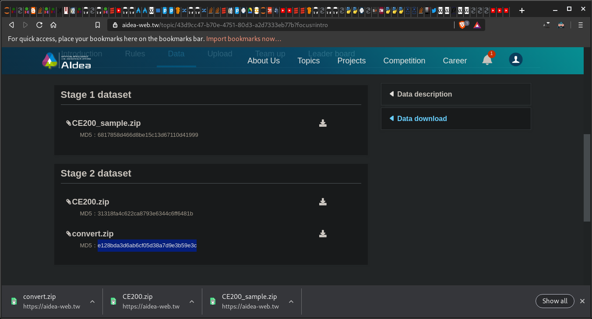

### How to use the **`-c`** (or **`--check`**) option?

<br>
<br>
<br>
<br>
For example, I downloaded this dataset. How could I check the md5 sum
in an efficient way?

01. Edit a text file containing **filename(s)** and its **corresponding md5 sum** like the `aidea.txt` below
    - The extension doesn't have to be `.txt`
02. **`md5sum -c aidea.txt`**

```bash
[phunc20@denjiro-x220 downloads]$ md5sum CE200_sample.zip
6817858d466d8be15c13d67110d41999  CE200_sample.zip
[phunc20@denjiro-x220 downloads]$ md5sum -c 6817858d466d8be15c13d67110d41999
md5sum: 6817858d466d8be15c13d67110d41999: No such file or directory
[phunc20@denjiro-x220 downloads]$ vim aidea.txt
[phunc20@denjiro-x220 downloads]$ cat aidea.txt
6817858d466d8be15c13d67110d41999  CE200_sample.zip
31318fa4c622ca8793e6344c6ff6481b  CE200.zip
e128bda3d6ab6cf05d38a7d9e3b59e3c  convert.zip
[phunc20@denjiro-x220 downloads]$ md5sum -c aidea.txt
CE200_sample.zip: OK
CE200.zip: OK
convert.zip: OK
[phunc20@denjiro-x220 downloads]$
```
