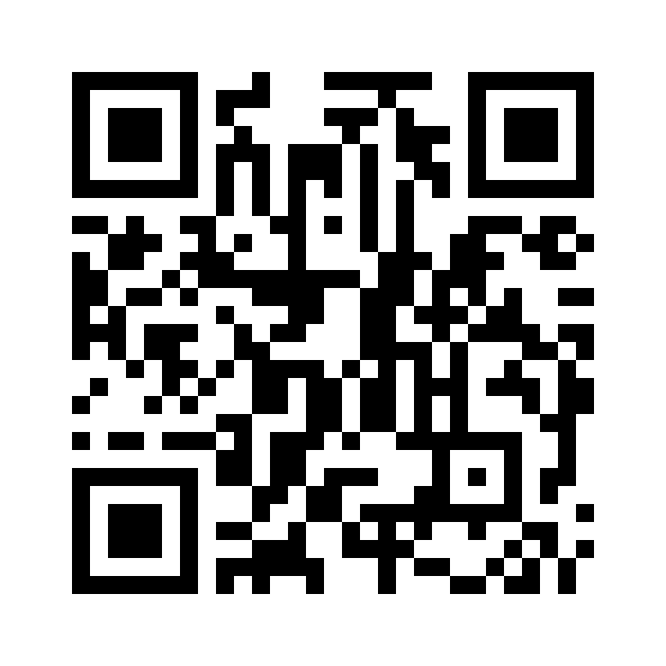

## Encode any text into QR code
- Use the command `qrencode` as follows. (`pacman -S qrencode`)
- `-s 20` is for a bigger size (`20` dots; the default is `3`)

```bash
[phunc20@homography-x220t corbeille]$ qrencode "Nguyễn Văn Ngốc Phụn, bún cá Nhê Trêng" -o nvnp.png
[phunc20@homography-x220t corbeille]$ sxiv nvnp.png
[phunc20@homography-x220t corbeille]$ sxiv nvnp.png
[phunc20@homography-x220t corbeille]$ sxiv nvnp.png
[phunc20@homography-x220t corbeille]$ qrencode -s 20 "Nguyễn Văn Ngốc Phụn, bún cá Nhê Trêng" -o nvnp.png
```


## Decode QR code
- **`zbarimg <image_file>`** (`pacman -S zbar`)
```bash
[phunc20@homography-x220t corbeille]$ zbarimg nvnp.png
QR-Code:Nguyễn Văn Ngốc Phụn, bún cá Nhê Trêng
scanned 1 barcode symbols from 1 images in 0.18 seconds

        . EAN/UPC (EAN-13, EAN-8, EAN-2, EAN-5, UPC-A, UPC-E, ISBN-10, ISBN-13)
        . DataBar, DataBar Expanded
        . Code 128
        . Code 93
        . Code 39
        . Codabar
        . Interleaved 2 of 5
        . QR code
        . SQ code
  - is the barcode large enough in the image?
  - is the barcode mostly in focus?
  - is there sufficient contrast/illumination?
  - If the symbol is split in several barcodes, are they combined in one image?
  - Did you enable the barcode type?
    some EAN/UPC codes are disabled by default. To enable all, use:
    $ zbarimg -S*.enable <files>
    Please also notice that some variants take precedence over others.
    Due to that, if you want, for example, ISBN-10, you should do:
    $ zbarimg -Sisbn10.enable <files>
```


