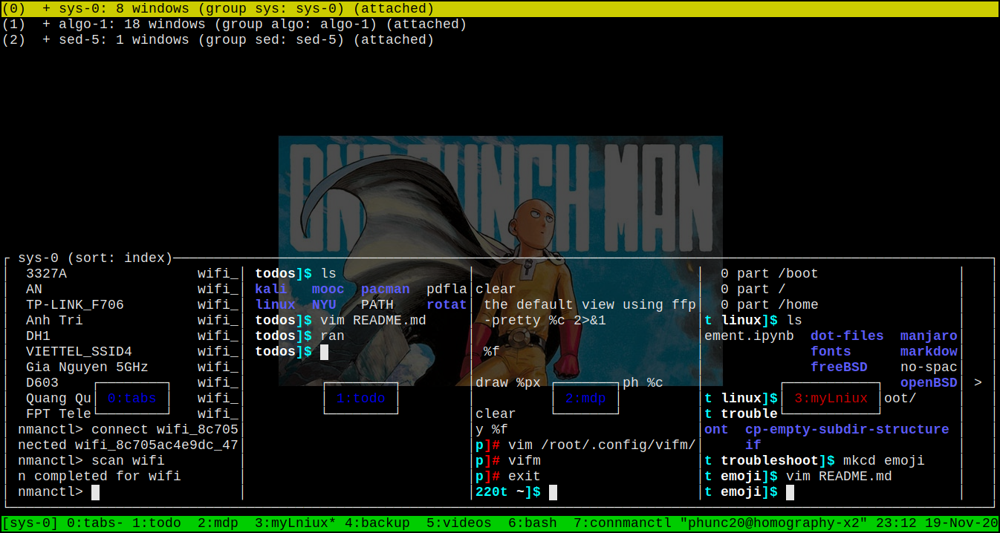
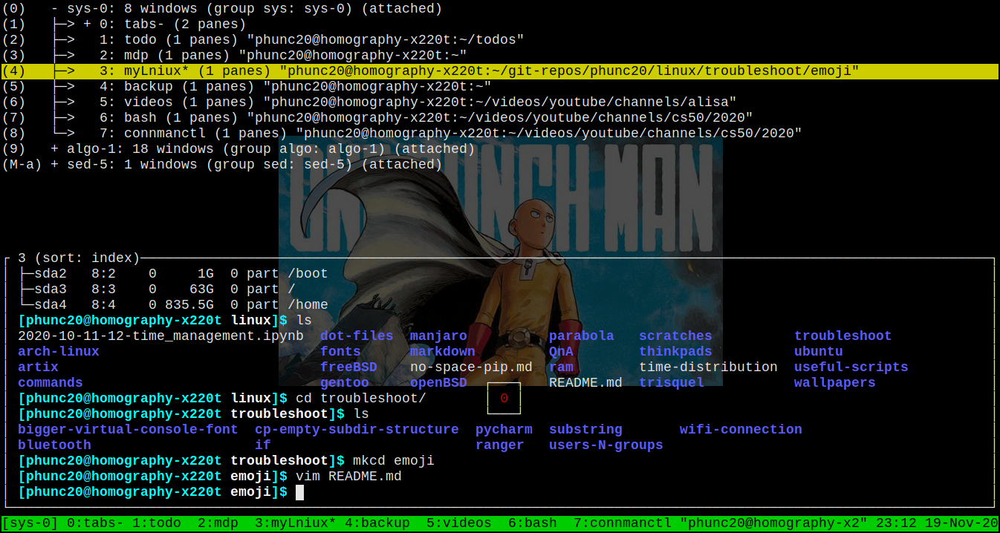

I shall call the default <code><b>ctrl-b</b></code> <b><code>trigger_keys</code></b>, one may map it to any other combinations to their likings.
## Vertical and Horizontal Splits
- How to create?
    - <code><b>trigger_keys</b></code> <code><b>%</b></code>
    - <code><b>trigger_keys</b></code> <code><b>"</b></code>
    - These are the default and can be changed to, for example, the more intuitive <code><b>|</b></code> and <code><b>-</b></code> by editing in <code><b>~/.tmux.conf</b></code>
- How to switch btw the splits?
    - <code><b>trigger_keys</b></code> <code><b>left_arrow</b></code>
    - <code><b>trigger_keys</b></code> <code><b>right_arrow</b></code>
    - <code><b>trigger_keys</b></code> <code><b>up_arrow</b></code>
    - <code><b>trigger_keys</b></code> <code><b>down_arrow</b></code>
- How to resize?
    - <code><b>trigger_keys</b></code> <code><b>:resize-pane \<-D|-U|-L|-R\> \<n\></b></code>, e.g. <code><b>:resize-pane -D 10</b></code>
    - or, alternatively, **`trigger_keys`** **`arrow_keys`**
- How to swap the positions of two splits/panes?
  - **`trigger_keys`** **`}`**


## Create and Attach to A New Session
- **`$ tmux`** creates a new session with **tab/name** being an automatically asigned number
- **`$ tmux new -t <nameYouLike>`** creates a new session with your **tab/name**
- **`$ tmux ls`** lists all the existing sessions
- **`$ tmux a <tabName>`** is an abbreviation to **`$ tmux attach <tabName>`**
    - **N.B.** You don't even have to spell the session name precisely, e.g. in the following, both **`rub`** and **`rubi`** will do for the session **`rubiks`** (since there is no ambiguity).
    ```bash
    [phunc20@tako-x60 ~]$ tmux ls
    rubiks-3: 5 windows (created Fri Oct 30 16:50:44 2020) (group rubiks)
    sys-0: 9 windows (created Fri Oct 30 14:35:59 2020) (group sys) (attached)
    [phunc20@tako-x60 ~]$ tmux a -t rubi
    [detached (from session rubiks-3)]
    [phunc20@tako-x60 ~]$ tmux a -t rub
    [detached (from session rubiks-3)]
    [phunc20@tako-x60 ~]$
    ```

```bash
[phunc20@denjiro-x220 02_ML_solutions]$ tmux ls
0: 16 windows (created Mon Oct 12 10:09:56 2020) (attached)
1: 2 windows (created Tue Oct 13 13:23:11 2020) (attached)
[phunc20@denjiro-x220 02_ML_solutions]$ tmux new -t food
[detached (from session food-4)]
[phunc20@denjiro-x220 02_ML_solutions]$ tmux ls
0: 16 windows (created Mon Oct 12 10:09:56 2020) (attached)
1: 2 windows (created Tue Oct 13 13:23:11 2020) (attached)
food-4: 1 windows (created Wed Oct 14 10:55:35 2020) (group food)
[phunc20@denjiro-x220 02_ML_solutions]$ tmux a -t food
```


## `trigger_keys s`
**`trigger_keys s`** for **s**witching btw diff tmux sessions and their windows.
- Use the arrow keys to move up and down, in and out
- Press `Enter` to confirm the choice to enter into that session/window




## Resize pane
**`:resize-pane -U 10`** where `U` means **U**p and can be replaced by `D`, `L`, `R`

More precisely,
```
Usage:
resize-pane [-DLRUZ] [-x width] [-y height] [-t target-pane] [adjustment]
```
Exp: `resize-pane -t 1 -y 5`


## Switch, or Swap, pane
- either `trigger_keys {` (or `trigger_keys }`) 
- or `:swap-pane -U` (or `:swap-pane -D`)


## Unknown
- `trigger_keys m`


## Other Useful Ones
- `trigger_keys ' <number>`: switch to tab with `index=<number>`


## Rename Sessions
- from within `tmux`: **`trigger_keys $`**
- from command line: **`tmux rename-session [-t session-name] <new-session-name>`**
- [https://leimao.github.io/blog/Tmux-Tutorial/#:~:text=Alternatively%2C%20we%20may%20also%20hit,session%20in%20the%20Tmux%20terminal.](https://leimao.github.io/blog/Tmux-Tutorial/#:~:text=Alternatively%2C%20we%20may%20also%20hit,session%20in%20the%20Tmux%20terminal.)


## Close/Kill
- kill panes: `trigger_keys x`
- Sometimes when using `tmux` with a remote machine, it is possible that `tmux` simply goes dumb and does not react to any command. In this case, one may want to kill the session. This can be achieved by `tmux kill-session -t <name>`
  ```bash
  ubuntu@ip-123-45-78-90: $ tmux ls
  0: 2 windows (created Wed Dec 29 03:09:38 2021) [135x33]
  ubuntu@ip-123-45-78-90: $ tmux kill-session -t 0
  ubuntu@ip-123-45-78-90: $ tmux ls
  no server running on /tmp/tmux-1000/default
  ubuntu@ip-123-45-78-90: $
  ```
