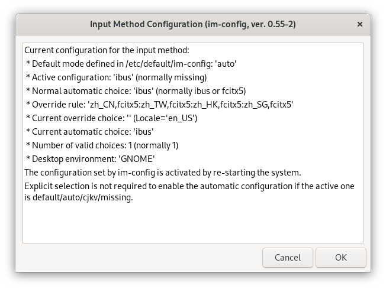
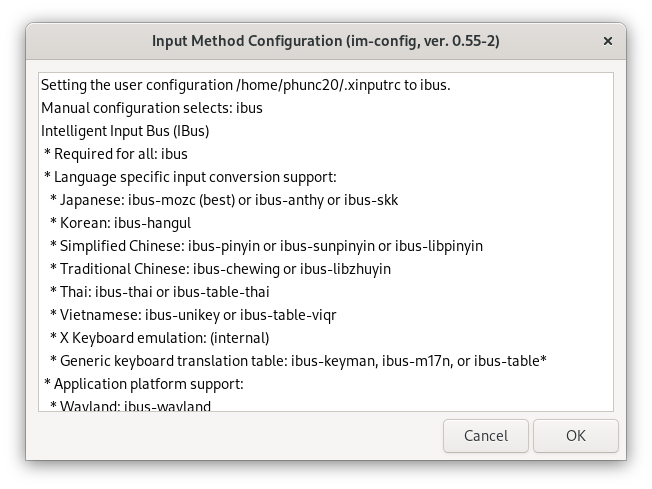

1. `$ im-config` to open up configuration UI:
    1. Click on the `OK` button in the first UI window to proceed.
       
    2. Click on the `Yes` button in the second window.
       
    3. Select `ibus` and then click on the `OK` button to proceed.
       
    4. Click on the `OK` button in the last UI window to complete the configuration.
       
    5. Restart/reboot the machine.
2. `apt install` input methods
    - Chinese
    	- Pinyin: `ibus-pinyin`
    - Vietnamese
    	- Telex: `ibus-unikey`
2. `Setting` -> `Keyboard` -> `Input Sources`. Click on the `+` button to add a new input method
    - Chinese
    	- Pinyin: Search and add `Chinese (Pinyin)`
    - Vietnamese
    	- Telex: Search and add `Vietnamese (Unikey)`
