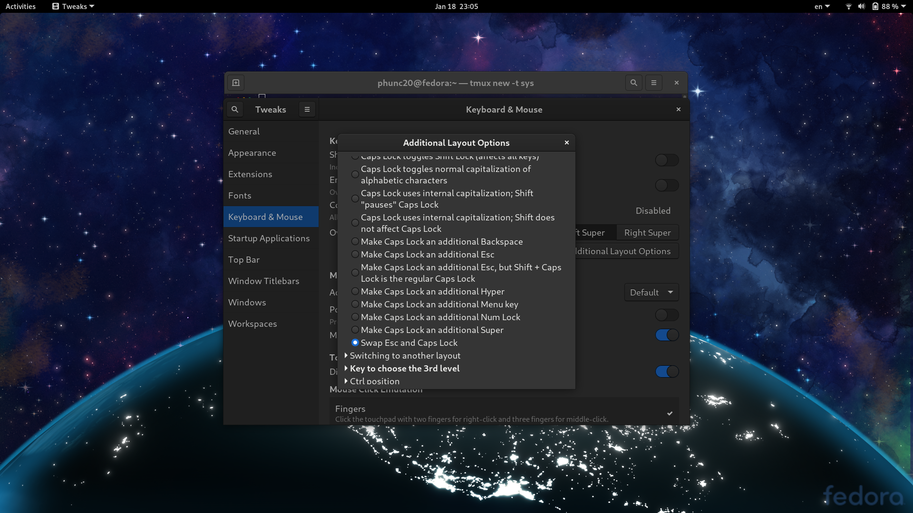

## Under Fedora33's default gnome
`xmodmap ~/.Xmodmap` could remap keys but like every 5 or so minutes, the remapped keys **get wipped out**, returning back to the default mapping.

At first, I guess there is a service related to gnome running in the background which caused this, but I wasn't sure. Then I had time to investigate, and here seems to be one wordaround I found out:
- I ran `systemctl status` to inspect and find out a suspect 
  ```bash
  ├─org.gnome.SettingsDaemon.Keyboard.service
  │ └─2541 /usr/libexec/gsd-keyboard
  ```
- Then, I tried to kill it and it works: `pkill gsd-keyboard`
- Finally, we can run `xmodmap ~/.Xmodmap` as usual

Searching on the Internet, I also found that usually gnome users remap keys via `gnome-tweaks > [Keyboard & Mouse] > [Additionaly Layout Options]`, which
does provide interesting options like **swapping Esc and CapsLock**. However, finer-grained remapping, e.g. mapping `+` to `PgUp`, seems impossible.




