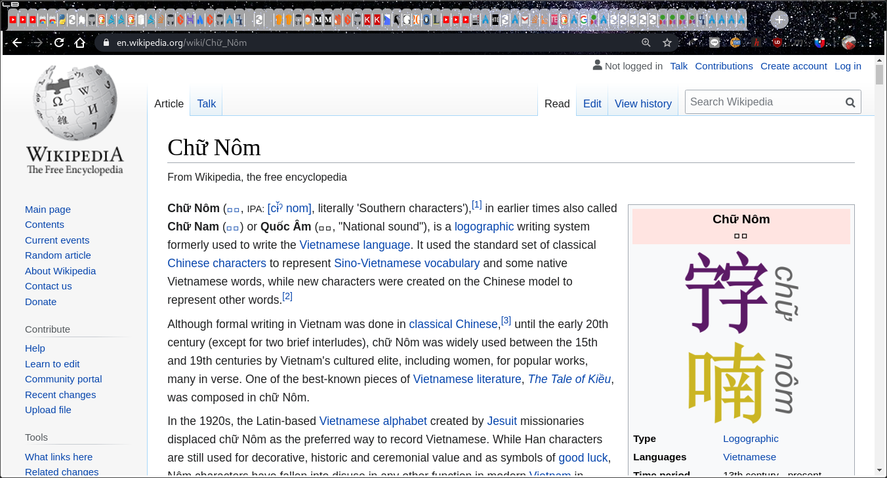
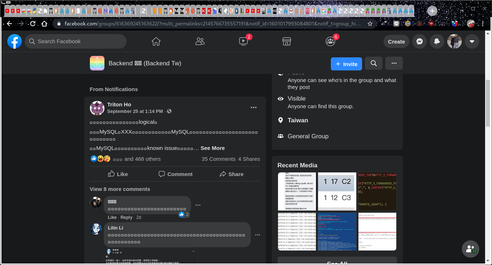
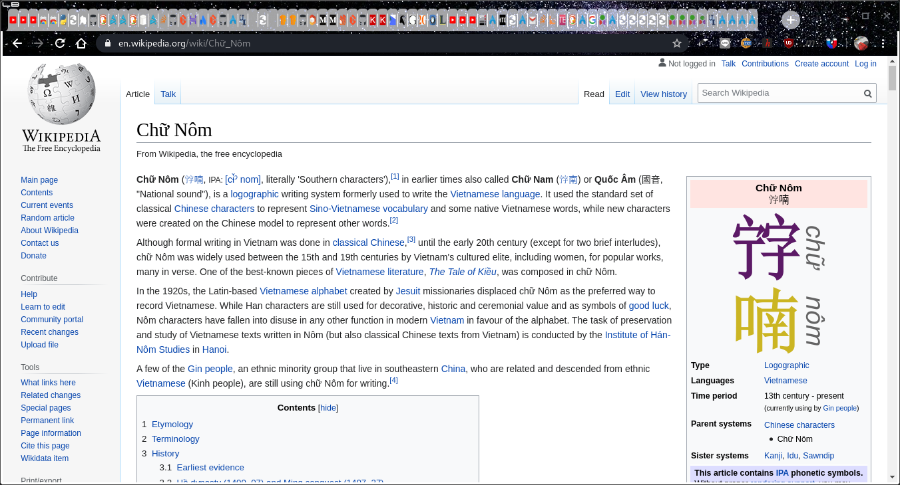
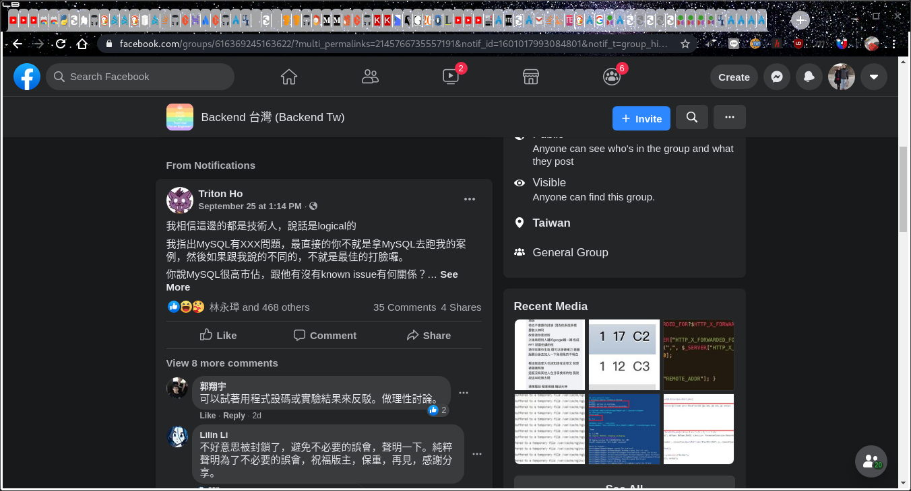

## Which Packages Are Needed to Display Different Characters and Letters from Different Languages?

A freshly installed Arch/Artix and chromium will **not be able** to display Chinese/Japanese characters.

There seems to be many font packages that one can install, one of the most recommended one being
- <code><b>noto-fonts-cjk</b></code> (<code><b>cjk</b></code> stands for <b>C</b>hinese/<b>J</b>apanese/<b>K</b>orean; on Arch, one can install this by <code><b>sudo pacman -S noto-fonts-cjk</b></code>)

Besides, if you're interested in displaying the old, deprecated Vietnamese font <b>chữ nôm (𡨸喃)</b>,
- <code><b>sudo pacman -S ttf-hannom</b></code>

Let's see the <b>before</b> and <b>after</b>. 
<b>N.B.</b> In <code>chromium</code>, in order to have the change, one not only has to install, but also needs to **close and re-open** <code>chromium</code> for the change to be properly detected.

### Before
- Wikipedia   
- Facebook   

### After
- After <code>sudo pacman -S noto-fonts-cjk</code>   
- After <code>sudo pacman -S ttf-hannom</code> (in addition to <code>noto-fonts-cjk</code>)   
- After <code>sudo pacman -S noto-fonts-cjk</code>   

**Rmk.** As a side effect, these installations will also enable Chinese/Vietnamese displaying inside **terminal emulators**.

## Similarly, to display emojis
one needs special font, e.g.
> <code><b>sudo pacman -S noto-fonts-emoji</b></code>

After the installation, one needs to <b>close the browser</b> and <b>then reopen it</b> for the newly installed font to take effect.
