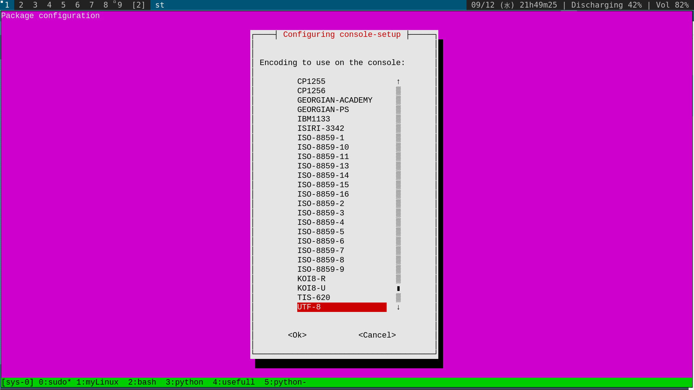

## Terminus font
- Like in other distro, the terminus font can display bigger font on vconsole (aka `tty1 - tty6`). On Ubuntu, terminus font can be installed via **`sudo apt install xfonts-terminus`**
- **Unlike** in other distro, or at least unlike Arch-based distro, the following ways won't work if one wants to reconfigure vconsole's font:
  - `setfont ter-122b`
  - Add line `FONT=ter-122b` to the file `/etc/vconsole.conf`
- **Instead**, Ubuntu, or at least Ubuntu 18.04, does this via the command **`sudo dpkg-reconfigure console-setup`**

```bash
ec2-user@ip-54-147-126-214: ~$ sudo dpkg-reconfigure console-setup
update-initramfs: deferring update (trigger activated)
Processing triggers for initramfs-tools (0.130ubuntu3.9) ...
update-initramfs: Generating /boot/initrd.img-5.4.0-48-generic
W: Possible missing firmware /lib/firmware/rtl_nic/rtl8125a-3.fw for module r8169
W: Possible missing firmware /lib/firmware/rtl_nic/rtl8168fp-3.fw for module r8169
```



